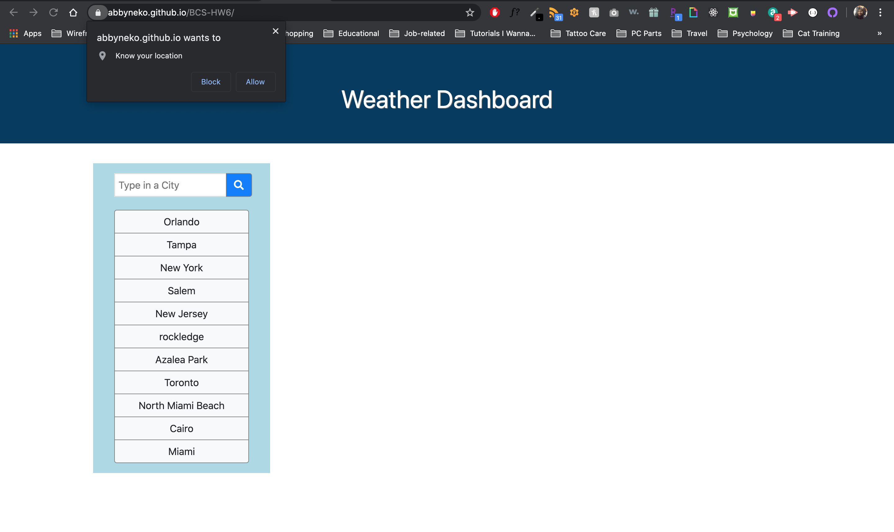
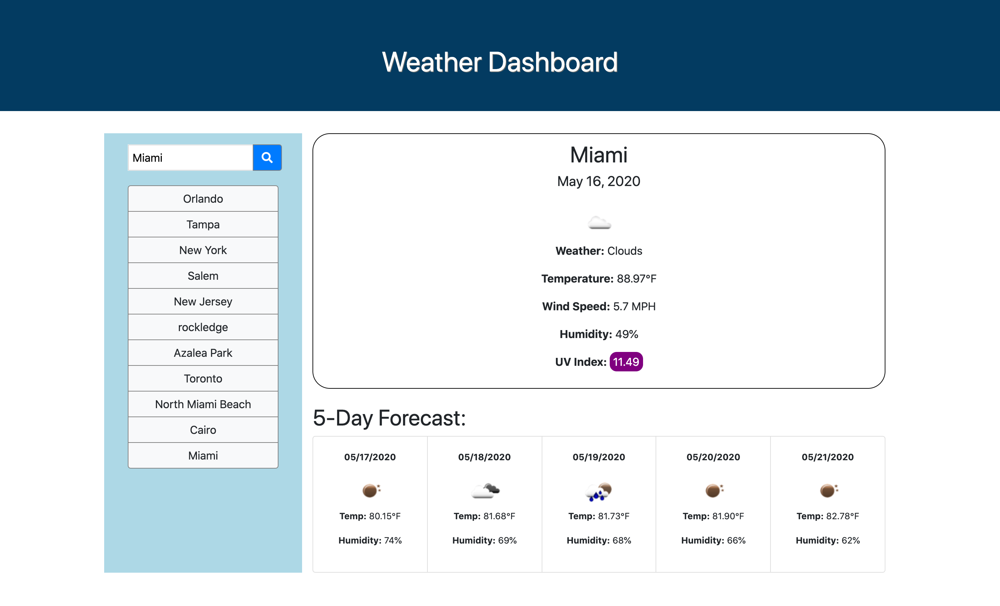
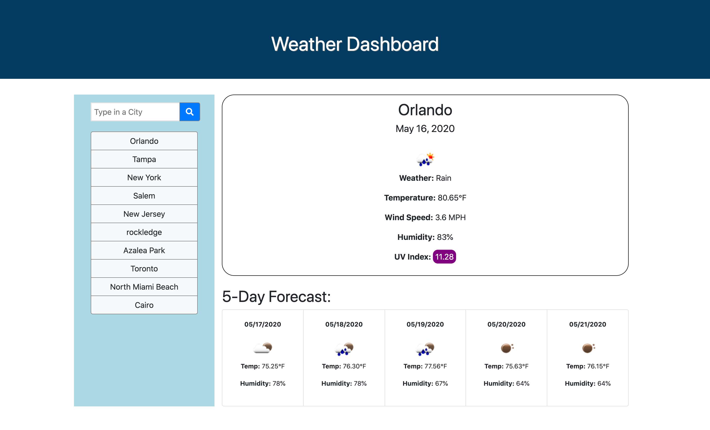

# Weather Dashboard

To show the current weather conditions based on the city name the user enters.

## Table of Contents
* Installation
* Usage
* Technologies Used
* License
* Contributing
* Tests
* Questions

## Installation
To install, fork this repo or download a copy of the code.

## Usage

When you go to the Weather Dashboard for the first time, it will ask you for your location. If you press "Allow", it will automatically display the weather data for your area.

Alternatively, you can just type in the City name and press Search.

Every time a city name is entered, the weather data is automatically displayed and a link appears on the left so you can revisit the weather data for these cities later on. You can look at the updated weather data for this city simply by clicking on one of the links to the left of the site as shown below.

## Built With
* HTML
* CSS
* JavaScript
* Open Weather API

## License
[MIT](https://choosealicense.com/licenses/mit/)

## Contributing
You can add on additional changes to the code. However, you must switch out the API for  your own by registering for an account at the OpenWeather API account.

## Tests
To test this project, click all the buttons and make sure they work correctly. Be sure to check the console log for errors.

